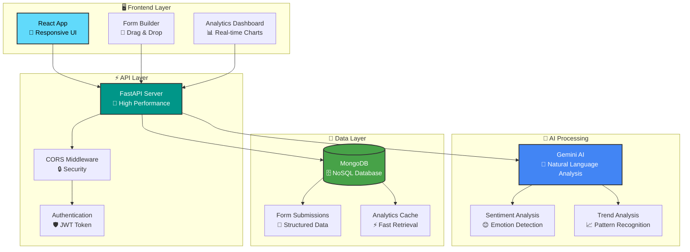
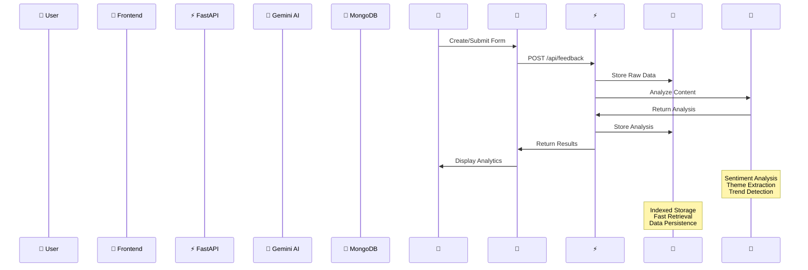

<div align="center">

# FeedWise


<p align="center">
  <strong>Transform feedback into actionable insights with AI-powered analytics</strong>
</p>

<p align="center">
  FeedWise revolutionizes feedback management by combining cutting-edge AI analysis with intuitive data visualization, enabling businesses to understand their customers like never before.
</p>

</div>

---

## �️ Tech Stack

<div align="center">

### 🎯 Backend Powerhouse
<p>
  
  
  
  
</p>

### 🧠 AI & Machine Learning
<p>
  
  
</p>

### 🎨 Frontend Excellence
<p>
  
  
  
  
</p>

### 🔧 Development Tools
<p>
  
  
  
</p>

</div>

## 🏗️ System Architecture

<div align="center">



</div>

## ✨ Key Features

<div align="center">

| Feature | Description | Status |
|---------|-------------|--------|
| 🎯 **Smart Form Builder** | Intuitive drag-and-drop interface for creating custom feedback forms | ✅ Active |
| 🤖 **AI-Powered Analysis** | Advanced sentiment analysis using Google's Gemini AI | ✅ Active |
| 📊 **Interactive Dashboards** | Real-time charts and visualizations with Chart.js | ✅ Active |
| 🔄 **Live Updates** | WebSocket-based real-time feedback processing | ✅ Active |
| 📱 **Mobile Responsive** | Seamless experience across all devices and screen sizes | ✅ Active |
| � **Enterprise Security** | MongoDB encryption and secure API endpoints | ✅ Active |
| 📈 **Trend Analysis** | Historical data analysis and predictive insights | 🚧 Beta |
| 🌐 **Multi-language Support** | International feedback collection and analysis | 🔮 Planned |

</div>

### 🎪 Feature Highlights

<details>
<summary><strong>🔽 Smart Form Builder</strong></summary>

- **Drag & Drop Interface**: Intuitive form creation with visual components
- **Custom Field Types**: Text, ratings, multiple choice, and more
- **Conditional Logic**: Dynamic form behavior based on user responses
- **Template Library**: Pre-built templates for common use cases

</details>

<details>
<summary>🤖 <strong>AI-Powered Analytics</strong></summary>

- **Sentiment Analysis**: Understand emotional tone of feedback
- **Theme Extraction**: Automatically identify key topics and themes
- **Trend Detection**: Spot patterns and changes over time
- **Actionable Insights**: AI-generated recommendations for improvement

</details>

<details>
<summary>📊 <strong>Visualization Engine</strong></summary>

- **Interactive Charts**: Doughnut, radar, and area charts
- **Real-time Updates**: Live data streaming and updates
- **Export Capabilities**: PDF and image export for reports
- **Custom Dashboards**: Personalized view for different stakeholders

</details>

## 🚀 Quick Start Guide

<div align="center">

### 🔧 Prerequisites Checklist

| Requirement | Version | Status |
|-------------|---------|--------|
|  | 3.9+ | Required |
|  | 16+ | Required |
|  | 4.4+ | Required |
|  | Key | Required |

</div>

### 🎯 Backend Setup

<details>
<summary>📦 <strong>Step-by-step Backend Installation</strong></summary>

```bash
# 1️⃣ Navigate to backend directory
cd backend

# 2️⃣ Create and activate virtual environment
python -m venv venv

# Windows
.\venv\Scripts\activate

# macOS/Linux
source venv/bin/activate

# 3️⃣ Install dependencies
pip install -r requirements.txt

# 4️⃣ Install additional packages
pip install fastapi uvicorn[standard] python-dotenv google-generativeai motor

# 5️⃣ Set up environment variables
cp .env.example .env
# Edit .env with your configuration

# 6️⃣ Start the server
cd app
uvicorn main:app --reload --host 0.0.0.0 --port 8000
```

</details>

### 🎨 Frontend Setup

<details>
<summary>⚛️ <strong>Step-by-step Frontend Installation</strong></summary>

```bash
# 1️⃣ Navigate to frontend directory
cd frontend

# 2️⃣ Install dependencies
npm install

# 3️⃣ Set up environment variables
cp .env.example .env
# Configure your API endpoints

# 4️⃣ Start development server
npm run dev

# 5️⃣ Build for production
npm run build

# 6️⃣ Preview production build
npm run preview
```

</details>

### 🐳 Docker Setup (Optional)

<details>
<summary>🐋 <strong>Containerized Deployment</strong></summary>

```bash
# 1️⃣ Build and run with Docker Compose
docker-compose up -d

# 2️⃣ View logs
docker-compose logs -f

# 3️⃣ Stop services
docker-compose down
```

</details>

## ⚙️ Configuration

<div align="center">

### 🔐 Environment Variables

</div>

#### Backend Configuration (`.env`)
```env
# 🗄️ Database Configuration
MONGO_URI=mongodb://localhost:27017/feedwise_db

# 🤖 AI Configuration  
GEMINI_API_KEY=your_gemini_api_key_here

# 🚀 Server Configuration
DEBUG=True
HOST=0.0.0.0
PORT=8000

# 🔒 Security
JWT_SECRET_KEY=your_jwt_secret_key
CORS_ORIGINS=http://localhost:3000,http://localhost:5173
```

#### Frontend Configuration (`.env`)
```env
# 🌐 API Configuration
VITE_API_URL=http://localhost:8000
VITE_API_TIMEOUT=30000

# 📊 Analytics
VITE_ANALYTICS_ENABLED=true
VITE_DEBUG_MODE=false
```

### 🎛️ Advanced Configuration

<details>
<summary>🔧 <strong>MongoDB Setup</strong></summary>

```javascript
// MongoDB Collections Structure
{
  "form_submissions": {
    "_id": "ObjectId",
    "form_id": "string",
    "user_data": "object",
    "analysis": "object",
    "sentiment_score": "number",
    "created_at": "datetime",
    "updated_at": "datetime"
  }
}
```

</details>

<details>
<summary>🤖 <strong>AI Model Configuration</strong></summary>

```python
# Gemini AI Settings
MODEL_NAME = "gemini-pro"
MAX_TOKENS = 1024
TEMPERATURE = 0.7
TOP_P = 0.8
```

</details>

## 🧩 Project Structure

<div align="left">

```
📁 FeedWise/
├── 📊 backend/
│   ├── 📱 app/
│   │   ├── 🐍 main.py           # FastAPI application
│   │   └── 📋 models.py         # Data models
│   ├── 📄 requirements.txt      # Python dependencies
│   └── 🔐 .env                  # Environment variables
│
├── 🎨 frontend/
│   ├── 📁 src/
│   │   ├── ⚛️ App.jsx          # Main React component
│   │   ├── 🎯 main.jsx         # Application entry point
│   │   ├── 💄 index.css        # Global styles
│   │   ├── 🌐 api/
│   │   │   └── 📡 api.js       # API client
│   │   └── 🧩 components/
│   │       ├── 🎪 CustomFormBuilder.jsx
│   │       ├── 📊 FeedbackAnalysis.jsx
│   │       ├── 📝 FeedbackForm.jsx
│   │       ├── 📋 FeedbackList.jsx
│   │       ├── 🔗 FormConnector.jsx
│   │       ├── 🎯 HeroHeader.jsx
│   │       ├── 🧭 NavBar.jsx
│   │       ├── ❓ FAQSection.jsx
│   │       ├── 📚 Documentation.jsx
│   │       ├── 📖 HowItWorks.jsx
│   │       └── 🦶 Footer.jsx
│   ├── 📦 package.json          # Dependencies
│   ├── ⚡ vite.config.js       # Vite configuration
│   ├── 🎨 tailwind.config.js   # Tailwind CSS config
│   └── 📋 eslint.config.js     # ESLint configuration
│
└── 📚 README.md                 # This file
```

</div>

### 🎯 Component Overview

| Component | Purpose | Features |
|-----------|---------|----------|
| `CustomFormBuilder` | 🎪 Form creation interface | Drag & drop, field validation |
| `FeedbackAnalysis` | 📊 AI analytics dashboard | Charts, sentiment analysis |
| `FeedbackForm` | 📝 User feedback interface | Dynamic forms, validation |
| `FeedbackList` | 📋 Feedback management | Filtering, sorting, export |
| `FormConnector` | 🔗 Form integration | API connections, webhooks |

## � Data Flow & Process

<div align="center">



</div>

### 🚀 Process Flow

1. **📝 Form Creation**: Users design custom feedback forms using the drag-and-drop builder
2. **📊 Data Collection**: End-users submit feedback through generated forms
3. **🔍 AI Processing**: Gemini AI analyzes content for sentiment, themes, and insights
4. **💾 Data Storage**: Processed data is stored in MongoDB with proper indexing
5. **📈 Visualization**: Interactive charts and dashboards display analyzed results
6. **🎯 Insights**: Actionable recommendations are generated for stakeholders

### 🔧 API Endpoints

<details>
<summary>📡 <strong>REST API Documentation</strong></summary>

| Method | Endpoint | Description | Auth |
|--------|----------|-------------|------|
| `GET` | `/api/health` | Health check | ❌ |
| `POST` | `/api/forms` | Create new form | ✅ |
| `GET` | `/api/forms/{id}` | Get form details | ✅ |
| `POST` | `/api/feedback` | Submit feedback | ❌ |
| `GET` | `/api/analytics/{form_id}` | Get analytics | ✅ |
| `POST` | `/api/analyze` | Trigger AI analysis | ✅ |

</details>

## 🤝 Contributing

<div align="center">


</div>

We love contributions! Here's how you can help make FeedWise even better:

### 🎯 Ways to Contribute

- 🐛 **Bug Reports**: Found a bug? [Open an issue](../../issues)
- 💡 **Feature Requests**: Have an idea? [Start a discussion](../../discussions)
- 📝 **Documentation**: Help improve our docs
- 🧪 **Testing**: Add tests for better coverage
- 🎨 **UI/UX**: Enhance the user experience

### 🚀 Development Workflow

<details>
<summary>📋 <strong>Step-by-step Contribution Guide</strong></summary>

```bash
# 1️⃣ Fork the repository
git fork https://github.com/username/feedwise.git

# 2️⃣ Create your feature branch
git checkout -b feature/amazing-feature

# 3️⃣ Make your changes
# ... code, code, code ...

# 4️⃣ Run tests
npm test              # Frontend tests
python -m pytest     # Backend tests

# 5️⃣ Commit your changes
git commit -m "✨ Add amazing feature"

# 6️⃣ Push to your branch
git push origin feature/amazing-feature

# 7️⃣ Open a Pull Request
```

</details>

### 📝 Coding Standards

- **Python**: Follow PEP 8 guidelines
- **JavaScript**: Use ESLint configuration
- **Commits**: Use [Conventional Commits](https://conventionalcommits.org/)
- **Documentation**: Update README and inline docs

## � License

<div align="center">


This project is licensed under the **MIT License** - see the [LICENSE](LICENSE) file for details.

You can use, modify, and distribute this project freely! 🎉

</div>

## 🙏 Acknowledgments

<div align="center">

### 💝 Special Thanks

| Technology | For | Link |
|------------|-----|------|
|  | Powerful Gemini AI capabilities | [Google AI](https://ai.google.dev/) |
|  | High-performance API framework | [FastAPI](https://fastapi.tiangolo.com/) |
|  | Amazing frontend library | [React](https://reactjs.org/) |
|  | Flexible database solution | [MongoDB](https://www.mongodb.com/) |
|  | Beautiful data visualizations | [Chart.js](https://www.chartjs.org/) |

### 🌟 Community

<p align="center">
  <a href="https://github.com/RaoVrn/feedwise/stargazers">
    
  </a>
  <a href="https://github.com/RaoVrn/feedwise/network/members">
    
  </a>
  <a href="https://github.com/RaoVrn/feedwise/watchers">
    
  </a>
</p>

</div>

---
<div align="center">


</div>